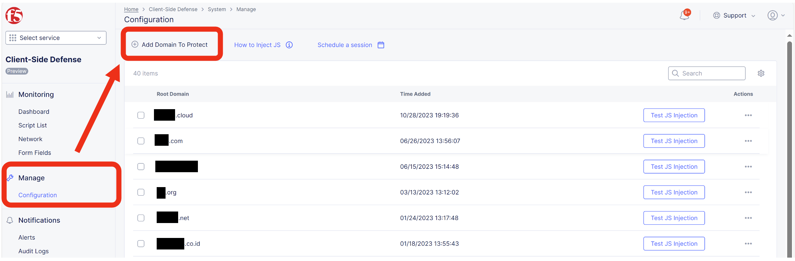
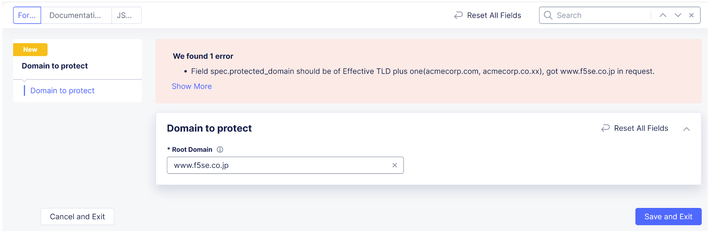

XC Consoleでの設定
======================================

1. XC Consoleにアクセスし、以下の通り、 [ Home ] - [ Client-Side Defense ] をクリックします。

.. figure:: images/Picture1.png
   :scale: 50%
   :align: center

2. [ Dashboard ] が表示されます。

3. 保護対象サイトの設定をします。

   [ Home ] - [ Client-Side Defense] - [ Manage ] – [ Configuration ] から、 [ Add Domain To Protect ] をクリックします。

4. 対象サイトの [ Root Domain ] を追加し、 [ Save and Exit ] をクリックします。

- 参考）Root Domainは、eTDL(effective TLD)＋1の値でないと以下のようにエラーとなります。

5. 登録後、 [ Configuration ] に反映されていることを確認します。

6. [ How to Inject JS ] をクリックすると、CSD JSが表示されます。

   右の赤枠がスクリプトの内容となります。これを次項で挿入する設定を行います。

   .. figure:: images/Picture6.png
      :scale: 50%
      :align: center

- CSD JSの挿入方法は以下２パターンあります。

   (1). XCのHTTP LBで設定する場合

      CSD保護が必要な対象HTTP LBの設定にて、CSD機能を有効化し、CSD JSをLBで挿入するように設定します。（サーバ側での設定変更不要）

      [ Home ] - [ Web App and API Protection ] - [ Manage ] - [ Load Balancers ] - [ HTTP Load Balancers ]から対象のHTTP LBの右側 [ Action ] - [ Manage Configuration ]をクリックし、右上の [ Edit Configuration ]をクリックします。

      左側タブの [ Client-Side Defense ]をクリックし、下図の [ Client-Side Defense ] をDisableからEnableに変更し、 [ Edit Configuration ] から [ Insert JavaScript in All Pages ] 選択し、 [ Apply ] , [ Save and Exit ] をクリックします。

      .. figure:: images/Picture6-1.png
         :scale: 50%
         :align: center

   (2). サーバ側で設定する場合

      CSD保護が必要なサイトの Web ページで<head> タグと </head> タグの間に先ほどXC Consoleで確認したCSD JS をコピーし、挿入します。

      ※ <head> タグと </head> タグの間に他のスクリプトまたは JS タグがある場合は、CSD JS を他のスクリプトまたは JS タグの前に配置して、CSD JS が最初に読み込まれるように挿入してください。

7. 実際にパブリックにアクセスできるサイトへCSD JSを挿入した場合は、[Test JS Injection]からCSD JSが動作しているか確認できます。

   .. NOTE::
      - JavaScriptをすべてのページに挿入し、保護対象とすることを推奨（デフォルト値）しています。
      - 理由は、データの取得とデータの流出が異なるページで起こりうる可能性があリます。
      - 例えば、悪質なスクリプトでは、フォームのあるページでフォームデータをキャプチャし、ローカルストレージやCookieに保存することが可能です。その後、CSDが有効になっていないページで、スクリプトがこのデータを読み、悪意のあるドメインに送信するような攻撃もあるため、完全に保護するためには、全てのページでCSDを使用することを推奨しています。

※ なお、後述のGoogle Chromeを利用したテストではクライアント側ブラウザでCSD JSを挿入しているため [Test JS Injection] はエラーとなります。

