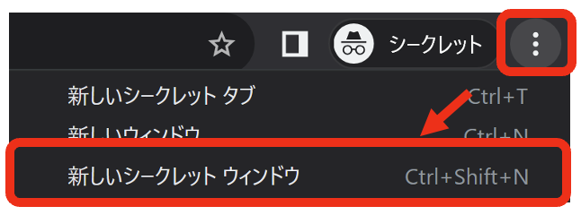
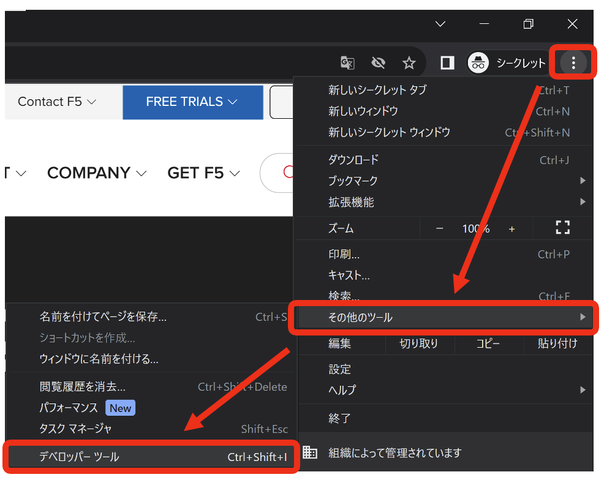
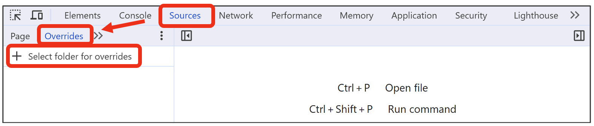
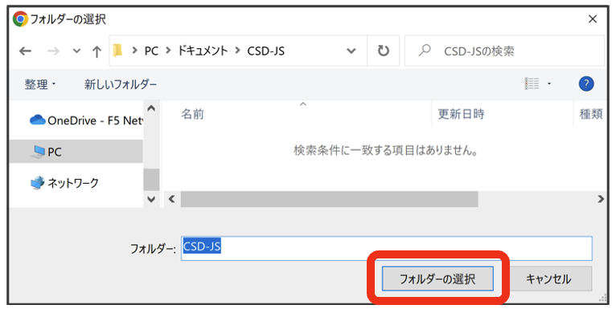
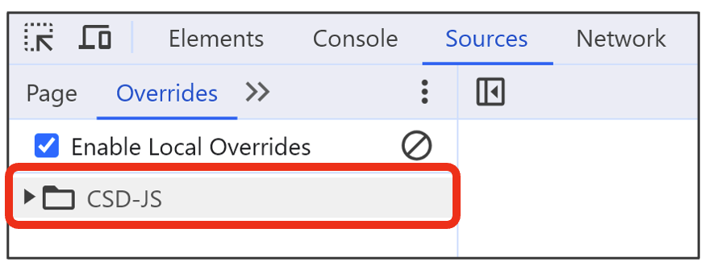
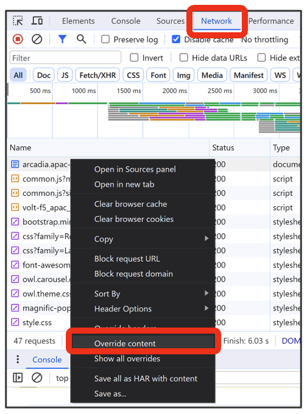
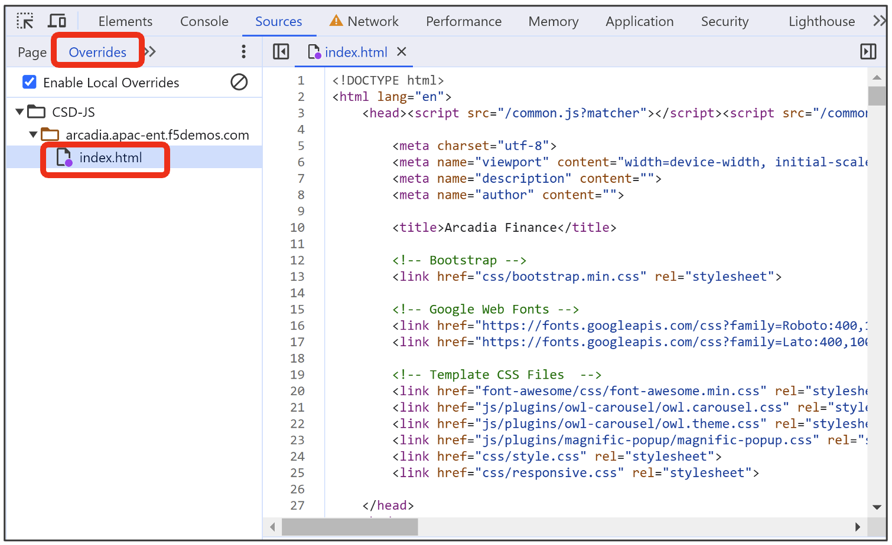
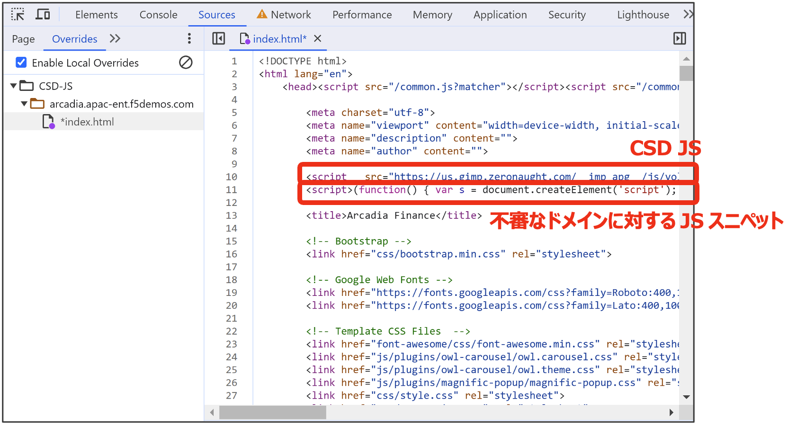
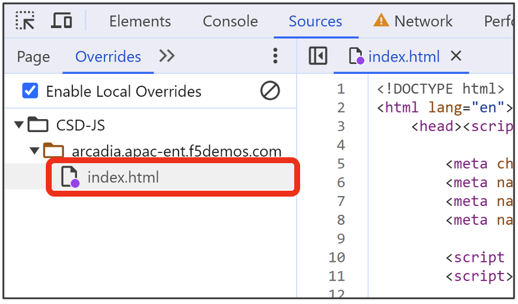
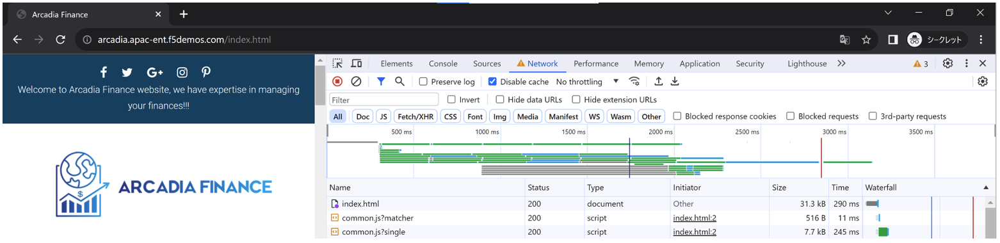

Google Chromeを使った動作確認
======================================

1. クライアントPCでGoogle Chromeブラウザを起動します。右上から [ シークレットモード ] で起動させます。

2. 右上から [ その他のツール ] - [ デベロッパー ツール ] をクリックします。

3.  [ Sources ] – [ Overrides ] - [ + Select folder for overrides ] をクリックします。

4. 任意のフォルダを作成し、 [ フォルダーの選択 ] をクリックします。

5. 以下のようにフォルダが作成されていることを確認します。

6. 対象URLにアクセスし、 [ Network ] タブをクリックします。対象の通信を選択し、右クリックで [ Override content ] を選択します。

7.  [ Sources ] – [ Overrides ] に戻ると作成したフォルダ配下に対象サイトのトップページ、本書では [ index.html ] が表示されます。

8. CSD JSが最初に読み込まれるように、CSD JSと不審なドメインに対するJSスニペットを挿入します。

.. code-block:: cmdin

   ＜不審なドメインに対するJSスニペット サンプル＞
   

9. 最後に保存することで、 [ *index.html ] から [ index.html ] になります。

10. 対象サイトに数回アクセスを実施します。

次章でXC CSDで、検知できているかを確認します。

