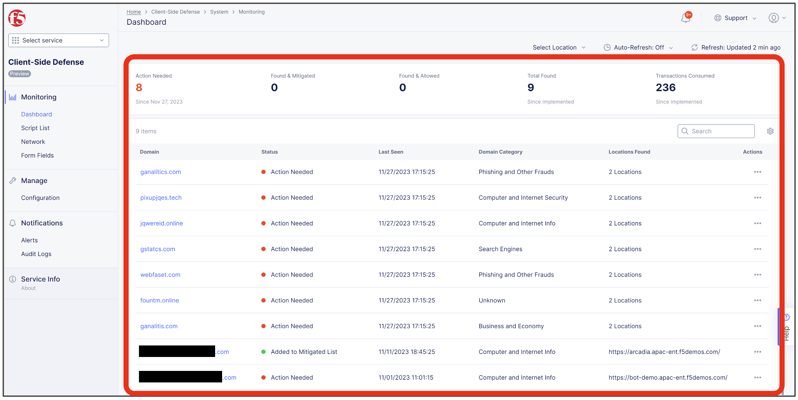
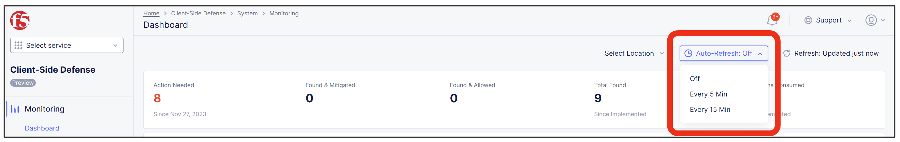
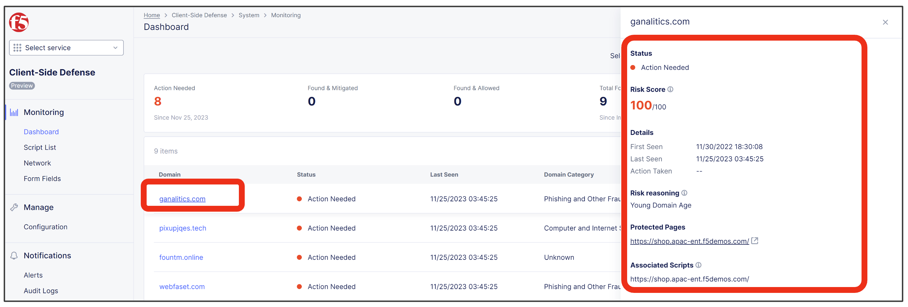

XC Consoleでの確認
======================================

1. 対象アクセスから5分以上経過後に Home > Client-Side Defense > Dashboard で確認すると、不正なドメインへのアクセスを検知している。

2. OverviewはAuto-Refreshを5分または15分で設定可能です。

3. DomainをクリックするとRisk Scoreなどが確認可能です。
   AI/MLによるRisk Score判定がHigh Riskに分類されると、StatusがAction Needed表示となるため、意図するドメインへの通信の場合は [Add To Allow List] へ、意図しないドメインへの通信の場合は [Add To Mitigate List] へ追加します。

4. 意図するドメインへの通信許可の設定

   (1). 対象DomainをAllow Listに追加します。

   .. figure:: images/Picture4-1.png
      :scale: 50%
      :align: center

   (2). 警告を確認し、AddをクリックでAllow Listへ登録完了です。

   .. figure:: images/Picture4-2.png
      :scale: 50%
      :align: center

   (3). Monitoring – Network > Allow Listタブから登録内容を確認可能です。

   .. figure:: images/Picture4-3.png
      :scale: 50%
      :align: center

5. 意図しないドメインへの通信遮断の設定

   (1). 対象DomainをMitigate Listに追加します。

   .. figure:: images/Picture5-1.png
      :scale: 50%
      :align: center

   (2). 警告を確認し、AddをクリックでMitigate List登録完了です。

   .. figure:: images/Picture5-2.png
      :scale: 50%
      :align: center

   (3). Monitoring – Network > Mitigate Listタブから登録内容を確認可能です。

   .. figure:: images/Picture5-3.png
      :scale: 50%
      :align: center

