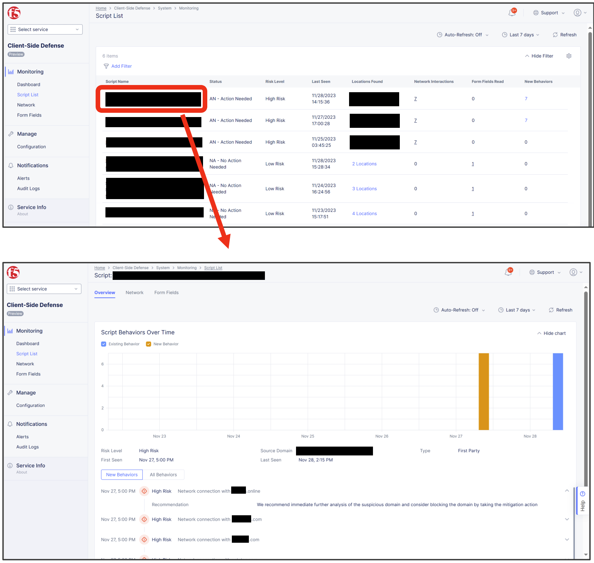
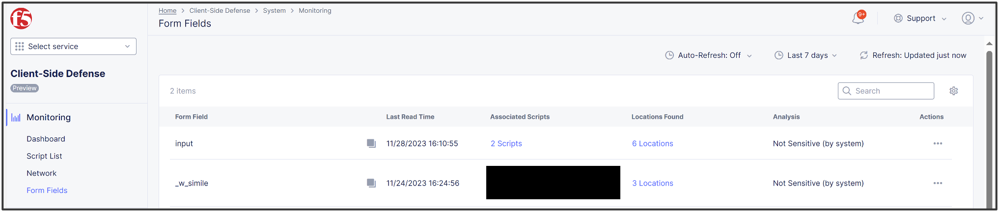
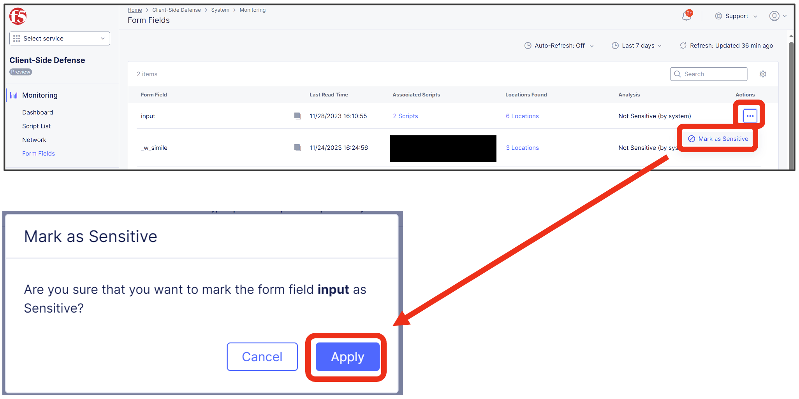
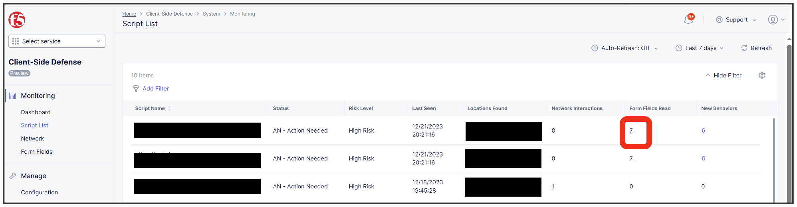
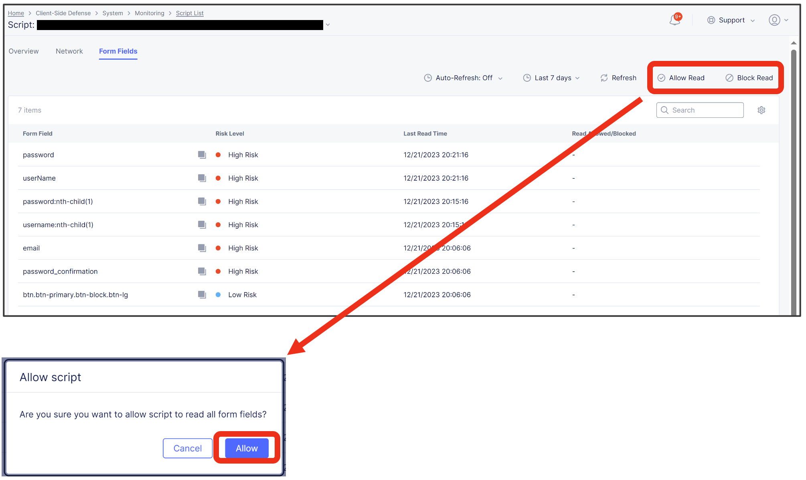

運用監視方法
======================================

監視時は検出スクリプト一覧から脅威内容を確認し、スクリプトが意図しないドメインへアクセスしていないか確認することと、意図しないForm Fieldの読み取りがないかを確認します。

1. 検出スクリプト一覧
   [ Home ] - [ Client-Side Defense ] - [ Monitoring ] - [ Script List ] から保護対象にて検出したスクリプトの一覧を表示可能。各スクリプトをクリックすることで詳細確認が可能です。

.. csv-table::

   "NA - No Action Needed", "該当スクリプトでは不審な点を未検出"
   "Resolved - No Action Needed", "該当スクリプトでいくつかの不審な動作を検出したが、ユーザがすでにアクションを実行済"
   "AN - Action Needed", "注意が必要なスクリプトで不審な動作を検出"

※ 検出したスクリプトがどのドメインへ通信を行っているか、どのForm Fieldの値を読み取ろうとしているか、振る舞いが確認可能です。

2. 意図する通信、意図しない通信のハンドリング
   `前項[4. XC Consoleでの確認]の4章,5章 <https://f5j-xc-csd.readthedocs.io/ja/latest/module04/module04.html>`_ をご参照ください。

3. Form Fieldの読み取りを抑止

   (1). Home > Client-Side Defense > Monitoring > Form Fields から特定のスクリプトによって読み取られる全フォームフィールドを確認することが可能です。

   (2). 特定のForm Fieldに対して、そのFieldを読み取ろうとするScriptがあった際に、Risk Scoreを ”High Risk” としてマークし、機微データへのアクセスリスクを管理することが可能です。

      該当FieldのActionsから [Mark as Sensitive]を選択し、適用することで、当該Fieldを機微データとして取り扱うことが可能です。

   (3). Form Fieldを読み取るScriptに対するMitigation Actionとして、意図するForm Fieldの読み取りの場合は [Allow Read] へ、意図しないForm Fieldの読み取りの場合は [Block Read] へ追加することが可能です。

      Home > Client-Side Defense > Monitoring > Script ListからForm Fields Readに数値が記録されているScriptを確認し、Form Fields Readの数字を選択します。

   (4). 該当Scriptが読み取っているForm Filedの一覧が表示され、それぞれのRisk Levelを確認可能です。前述の [Mark as Sensitive]にて該当Fieldを機微データとして登録しておくと、このFieldを読み取ろうとするScriptは ”High Risk” として記録されます。
これらのScriptによる該当Fieldの読み取り可否を確認の上、Mitigation Actionとして [Allow Read] もしくは [Block Read] を設定可能です。

4. Alertの通知設定

   CSDで発生したアラート通知の設定として、[Alert Receivers]ではどこに対しAlert Logを飛ばすかを設定し、[Alert Policies]では何のAlert Logを飛ばすか（ここではCSD Alert Log）を設定、最後にそれらの設定内容を [Active Alert Policies] として有効化することで、CSDアラート通知を設定可能です。

   (1). Alert Receiversの設定
      Home > Audit Logs & Alerts > Alerts Management > Alert Receivers にて、[Add Alert Receiver] を選択します。

      .. figure:: images/Picture4-1.png
         :scale: 50%
         :align: center

      .. figure:: images/Picture4-2.png
         :scale: 50%
         :align: center

      Receiver は下記から選択することが可能。(2023/12時点)
      - Slack
      - PagerDuty
      - OpsGenie
      - Email
      - SMS
      - Webhook

      設定入力後、[Save and Exit] を押下。Alert Receiverの設定が追加される。

      .. figure:: images/Picture4-3.png
         :scale: 50%
         :align: center

   (2). Alert Policiesの設定
      Home > Audit Logs & Alerts > Alerts Management > Alert Policiesにて、[Add Alert Policy] を選択。

      .. figure:: images/Picture4-4.png
         :scale: 50%
         :align: center

      Alert Policy設定では、先ほど設定したAlert Receiverの設定を紐づけ、Policy Rulesから[Security-CSD]を選択。

      .. figure:: images/Picture4-5.png
         :scale: 50%
         :align: center

      以下の通り、Security AlertsとGroupsを選択します。

      .. figure:: images/Picture4-6.png
         :scale: 50%
         :align: center

      Show Advanced Fieldsを押下することで、通知間隔を調整可能です。

      .. figure:: images/Picture4-7.png
         :scale: 50%
         :align: center

      設定入力後、[Save and Exit] を押下。Alert Policyの設定が追加される。

      .. figure:: images/Picture4-8.png
         :scale: 50%
         :align: center

   (3). Active Alertの設定
      Home > Audit Logs & Alerts > Alerts Management > Active Alert Policiesにて、[Select Active Alert Policies] を選択。

      .. figure:: images/Picture4-9.png
         :scale: 50%
         :align: center

      [Add Item] を押下 。

      .. figure:: images/Picture4-10.png
         :scale: 50%
         :align: center

      先ほど作成したAlert Policyを選択し、[Save and Exit] を押下

      .. figure:: images/Picture4-11.png
         :scale: 50%
         :align: center

      Active Alert Policyとして追加される（Namespaceは ”system” として作成される）

      .. figure:: images/Picture4-12.png
         :scale: 50%
         :align: center

      以上の設定により、CSDアラートが発生した際に、指定したReceiverに対してアラート通知を飛ばすことが可能。

これで、XC CSDのセットアップガイドは終了となります。

